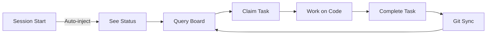

# Swarm Coordination - Quick Start

## What Is This?

A decentralized multi-agent system that lets multiple Claude Code instances collaborate on the same project without stepping on each other's toes.

**Key Features**:
- ✅ No central orchestrator - agents coordinate via Git
- ✅ File locking prevents conflicts
- ✅ Task dependencies managed automatically  
- ✅ Agent-to-agent messaging
- ✅ Automatic session context injection

## Prerequisites

- Claude Code with unified hooks system
- context-layer plugin installed
- Git repository

## 30-Second Setup

### 1. Initialize Swarm (First Time Only)

In your project directory, tell Claude:

```
Initialize swarm coordination for this project called "my-app"
```

Claude will use the `swarm_init` tool to create `.swarm/` structure.

### 2. Create Tasks

Edit `.swarm/board.json` or ask Claude:

```
Add a task to the swarm board:
- Title: "Implement user authentication"
- Skills: backend, typescript
- Files: src/auth/login.ts, src/middleware/auth.ts
- Priority: 1
```

### 3. Start Working

When you start a new session, you'll automatically see:
- Your assigned tasks
- Available tasks
- Unread messages
- Board status

Just say:
```
Query the swarm board and show me available tasks
```

Or:
```
Claim task-1 and start working on it
```

Claude uses the swarm MCP tools automatically!

## Agent Workflow



### Typical Commands

**Check status**:
```
What's the current swarm status?
Show me the task board
```

**Claim a task**:
```
Claim task-auth-1
Grab the highest priority task I'm qualified for
```

**Work on task**:
```
Implement the authentication flow for task-auth-1
```
(Files are automatically locked while you work)

**Complete task**:
```
Mark task-auth-1 as complete
I'm done with this task, move it to review
```

**Messaging**:
```
Send a message to bob@desktop asking about the API contract for /users endpoint
Check my messages from other agents
```

**Decisions**:
```
Log a decision: using JWT with 1h expiry for session tokens
```

## Manual Control

You can also directly call the MCP tools if needed:

```typescript
// Query board
await mcp.swarm_query_board({
  projectPath: process.cwd(),
  agentId: 'you@hostname',
  agentSkills: ['typescript', 'react']
});

// Claim task
await mcp.swarm_claim_task({
  projectPath: process.cwd(),
  taskId: 'task-1',
  agentId: 'you@hostname'
});

// Complete task  
await mcp.swarm_complete_task({
  projectPath: process.cwd(),
  taskId: 'task-1', 
  agentId: 'you@hostname',
  prUrl: 'https://github.com/...'
});
```

## Board Structure

`.swarm/board.json` uses Kanban columns:

- **backlog**: Tasks with unmet dependencies
- **ready**: Tasks ready to claim
- **in_progress**: Tasks being worked on
- **review**: Tasks completed, waiting for PR review
- **done**: Tasks merged/deployed

Tasks move automatically based on state:
- Claim → `ready` to `in_progress`
- Complete → `in_progress` to `review`
- Dependencies met → `backlog` to `ready`

## File Locking

When you claim a task, all its files are **automatically locked**:

```json
{
  "locks": {
    "src/auth/oauth.ts": {
      "task": "task-1",
      "agent": "you@hostname",
      "locked_at": "2026-01-19T14:30:00Z",
      "reason": "Implement OAuth2"
    }
  }
}
```

Other agents **cannot claim tasks** that touch locked files.

Locks **auto-expire** after 8 hours (configurable).

## Multi-Agent Sync

Each agent works in their own session, syncing via Git:

```bash
# Agent A claims task-1, works, commits
git pull
# Agent A sees task-1 is locked by Agent B
# Agent A claims task-2 instead
```

All `.swarm/` updates are git-committed automatically by tools.

**Workflow**:
1. `git pull` - Get latest board state
2. Claim task - Lock files, update board
3. Work - Make code changes
4. Complete - Unlock, move to review
5. `git push` - Share updates
6. Open PR for code review (standard flow)

## Example: Two Agents Building SaaS

**Agent A (alice@desktop)**:
```
Session starts → Sees: 3 ready tasks
Claims "Implement OAuth2" → Files locked
Works on src/auth/oauth.ts
Completes task → Unlocks files
Git push → Board updated
```

**Agent B (bob@laptop)** (simultaneously):
```
Session starts → Sees: 3 ready tasks
Tries "Implement OAuth2" → Blocked (locked by alice)
Claims "Build user profile UI" → Different files, no conflict
Works on src/components/Profile.tsx
Sends message to alice: "What's the auth middleware name?"
Git pull → Sees alice completed OAuth2
```

**Result**: Zero conflicts, both tasks progress independently!

## Tips

1. **Pull often**: `git pull` to see latest board state
2. **Smaller tasks**: Break work into 2-4 hour chunks
3. **Clear files list**: Specify exact files each task touches
4. **Use dependencies**: Chain tasks (task-2 depends on task-1)
5. **Message proactively**: Don't guess, ask other agents
6. **Review decisions.jsonl**: See architectural choices made

## Troubleshooting

**"Task not in ready state"**:
- Task might have unmet dependencies
- Check `board.json` → task's `depends_on` field
- Complete prerequisite tasks first

**"Files locked by another agent"**:
- Another agent is working on overlapping files
- Wait for them to complete, or message them
- Check lock timestamp - may be expired

**"No tasks available"**:
- All tasks claimed or blocked by dependencies
- Add more tasks to board
- Or work on your in-progress tasks

## Advanced: Creating Tasks Programmatically

You can ask Claude to add tasks via board editing:

```
Add these tasks to the swarm board:

1. Implement user registration
   - Skills: backend, typescript
   - Files: src/auth/register.ts
   - Depends on: task-auth-1
   
2. Build registration form UI
   - Skills: frontend, react
   - Files: src/components/Register.tsx
   - Depends on: task from #1
```

Claude will edit `board.json` and structure tasks with proper dependencies.

## Summary

**Setup**: One `swarm_init` call per project
**Work**: Query → Claim → Work → Complete → Sync
**Coordinate**: Messages, decision logs, file locks
**Safety**: Git-based, human-readable, no conflicts

That's it! The system stays out of your way until you need it.
